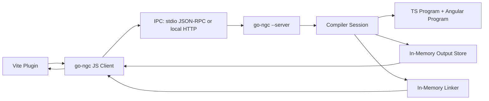

# go-ngc Esbuild-Style In-Memory Builder Roadmap

Date: 2026-06-03

## Executive Summary

The current `go-ngc` architecture is not ready to be treated as a production builder in the same way esbuild is used by Vite.
It is much closer than before on compiler correctness and cold compile speed, but its integration model is still batch-oriented:

- Vite calls `go-ngc` as a short-lived process.
- `go-ngc` compiles the whole Angular program.
- `go-ngc` writes emitted JavaScript and source maps to `outDir`.
- The Vite plugin later reads the generated files from disk in `load()`.
- The linker plugin may spawn `go-ngc --link` per dependency file.

This is workable for demos and early integration, but it is not the right production builder shape. The next architecture should expose
an in-memory build API, then put a persistent daemon/IPC layer around it, similar to the way esbuild exposes build results without forcing disk writes.

## Esbuild Reference Points

Esbuild supports both writing output files and returning generated files as in-memory buffers. Its `write: false` build option returns
`outputFiles` with path, contents, hash, and text instead of writing to disk:

- Official docs: https://esbuild.github.io/api/#write

Esbuild also has a long-running build context with `watch`, `serve`, and `rebuild`, which lets rebuilds reuse work from previous builds:

- Official docs: https://esbuild.github.io/api/#build

Esbuild also has a WASM package (`esbuild-wasm`) for browser/WebWorker usage:

- Official docs: https://esbuild.github.io/api/#in-the-browser

So yes, conceptually esbuild supports both relevant styles:

1. native/in-process API behavior with output returned in memory (`write: false`, context/rebuild);
2. WASM usage through `esbuild-wasm`.

For `go-ngc`, the best first target is native daemon + IPC, not WASM or N-API.

## Current Project State

### Compiler CLI

Current entrypoint:

- `angular-packages/compiler_cli/cmd/ngtsc/main.go`

Current compile flow:

- `ReadConfiguration(project)`
- `PerformCompilation(config)`
- `ngtsc.NewNgtscProgram(...)`
- `LoadNgStructureAsync`
- `GetNgDiagnostics`
- `ngProgram.Emit(...)`
- `WriteFile(fileName, text, data)`

Current emit callback still writes through `host.FS().WriteFile(fileName, text)`.
`--discard-output` only swaps the filesystem with a no-op filesystem; it does not return compiled files to the caller.

### Vite Plugin

Current plugin:

- `angular-packages/vite-plugin-angular-go/src/index.ts`

Current compile plugin behavior:

- calculates project input key;
- runs `go-ngc` with CLI args;
- maps `.ts` source path to `outDir/*.js`;
- reads generated `.js` and `.map` from disk;
- handles HMR metadata by reading generated JS from disk and extracting update functions with regex.

Current linker plugin behavior:

- checks for `ɵɵngDeclare`;
- invokes `go-ngc --link <file>`;
- caches linked code in memory per Vite process.

### Performance Implication

The compiler is already fast enough to justify investing in builder architecture, but the integration model is still inefficient:

- process startup cost exists for each compile/link call;
- disk output is mandatory for Vite compile path;
- Vite loads emitted code by path instead of using a compiler output map;
- HMR update modules are extracted from generated disk output;
- no persistent compiler program/cache survives between rebuilds;
- no batch linker protocol exists.

## Production Readiness Assessment

### Ready Enough

- Angular Render3 parity has improved significantly.
- Linker has passed many real-world PrimeNG/router cases.
- Cold compile performance is already strong compared with ngtsc on synthetic large apps.
- Vite integration is split into compile and linker plugins.
- HMR codegen exists experimentally.

### Not Yet Production Builder Ready

- No in-memory output API.
- No long-running compiler context.
- No stable IPC protocol.
- No incremental invalidation contract.
- No persistent linker service.
- HMR currently depends on regex extraction from emitted JS.
- Diagnostics are CLI-formatted strings, not structured protocol messages.
- Source maps are read from disk instead of returned with JS output.
- Compile mode and linker mode are still separate process invocations.
- There is no compatibility test matrix for in-memory outputs vs disk outputs.

## Target Architecture



The production direction should be:

1. Add an in-memory output API in Go.
2. Add a `--server` mode that keeps compiler sessions alive.
3. Change the Vite compile plugin to read outputs from the daemon instead of disk.
4. Change the linker plugin to batch/link through the same daemon.
5. Add incremental invalidation once the non-incremental in-memory path is stable.

## Design Principle

Do not start with per-file Angular compile.

Angular compilation is not the same as esbuild's isolated TS transform. Even local compilation needs project config, Angular metadata, external resources,
module resolution, and dependency context. The first production-safe API should be project-oriented:

- `create_context`
- `build`
- `get_output`
- `rebuild`
- `link`
- `dispose`

Only after this is correct should we add targeted per-file HMR APIs.

## Phase 0: Stabilize Current Baseline

Goal: make sure the current disk builder is a trustworthy baseline before replacing it.

Tasks:

- Run full Go test scope for compiler/linker/template pipeline.
- Run current Vite demo build and dev server smoke test.
- Record current benchmark:
  - cold compile to disk;
  - cold compile with `--discard-output`;
  - Vite dev startup;
  - Vite production build;
  - linker dependency optimize.
- Document current known semantic gaps.

Acceptance criteria:

- A baseline report exists before in-memory migration.
- Disk output and runtime demo are still working.
- Existing behavior is not changed by later phases without comparison.

## Phase 1: Add In-Memory Compile Output API

Goal: make `go-ngc` able to compile and return output files without writing to disk.

Add Go types:

```go
type OutputFile struct {
    Path string `json:"path"`
    Text string `json:"text"`
    Hash string `json:"hash,omitempty"`
    Kind string `json:"kind"` // js, map, dts, other
}

type BuildResult struct {
    Outputs []OutputFile `json:"outputs"`
    Diagnostics []DiagnosticMessage `json:"diagnostics"`
    Status int `json:"status"`
}
```

Implementation tasks:

- Extend `PerformCompilation` or add `PerformCompilationToMemory`.
- In the `EmitOptions.WriteFile` callback, collect `{fileName, text}` into a concurrent-safe output sink.
- Preserve current disk-writing path.
- Keep linker-in-emit behavior identical for JS outputs.
- Return `.js`, `.js.map`, `.d.ts`, and other emitted files in the output array.
- Add output hashing for Vite cache and HMR comparison.
- Add tests comparing disk output vs memory output byte-for-byte.

Acceptance criteria:

- `go-ngc` can produce equivalent outputs without writing to disk.
- Disk mode remains unchanged.
- Integration tests can run against memory output fixtures.

## Phase 2: Add CLI `--write=false` / JSON Output

Goal: expose in-memory output without daemon yet.

Tasks:

- Add CLI flag:
  - `--write=true|false`, default `true`;
  - `--format=text|json`, default `text`.
- For `--write=false --format=json`, print a structured `BuildResult` to stdout.
- Print diagnostics as structured JSON, not CLI-formatted text.
- Keep stderr clean for fatal/protocol errors.
- Add tests for JSON output shape.

Example:

```bash
go-ngc -p tsconfig.app.json --write=false --format=json
```

Acceptance criteria:

- Vite can call one-shot `go-ngc --write=false --format=json`.
- Output files are available without touching `outDir`.
- This works before daemon mode, which de-risks the migration.

## Phase 3: Update Vite Compile Plugin To Use Memory Outputs

Goal: stop reading generated JS from `outDir`.

Tasks:

- Add plugin option:
  - `write?: boolean`, default `false` in dev, configurable in build.
  - `mode?: "disk" | "memory" | "server"`.
- Store compiler outputs in an in-memory `Map<string, OutputFile>`.
- Change `load(id)`:
  - map source TS file to output path;
  - return code/map from output map;
  - only fall back to disk in `mode: "disk"`.
- Change HMR metadata handling to read from output map, not disk.
- Remove disk existence checks from memory/server mode.
- Keep source/template/style dependency tracking.

Acceptance criteria:

- Vite dev works without `outDir` writes.
- Vite production build can choose memory mode or disk mode.
- Existing disk mode remains available for debugging.

## Phase 4: Add `go-ngc --server`

Goal: avoid process startup and prepare for retained compiler state.

Recommended transport: stdio JSON-RPC first.

Why stdio first:

- no port allocation;
- lifecycle is naturally tied to parent process;
- easier to secure;
- similar to how many native tool integrations work;
- avoids exposing a local HTTP surface too early.

Protocol sketch:

```json
{"id":1,"method":"create_context","params":{"project":"tsconfig.app.json","cwd":"/repo/app","options":{"compilationMode":"global","hmr":true}}}
{"id":2,"method":"build","params":{"contextId":"ctx_1","write":false}}
{"id":3,"method":"get_output","params":{"contextId":"ctx_1","path":"/repo/app/out-tsc/app/src/app.js"}}
{"id":4,"method":"link","params":{"path":"/repo/app/node_modules/pkg/fesm2022/pkg.mjs"}}
{"id":5,"method":"dispose","params":{"contextId":"ctx_1"}}
```

Response sketch:

```json
{"id":2,"result":{"outputs":[{"path":"...","text":"...","hash":"...","kind":"js"}],"diagnostics":[],"status":0}}
```

Tasks:

- Add `--server` flag in `cmd/ngtsc/main.go`.
- Implement a JSON line protocol over stdin/stdout.
- Add request/response structs.
- Add structured errors.
- Ensure stdout only contains protocol messages in server mode.
- Implement lifecycle:
  - start;
  - create context;
  - build;
  - link;
  - dispose;
  - shutdown.
- Add server protocol tests using spawned process.

Acceptance criteria:

- Vite plugin can start exactly one `go-ngc --server` process.
- Build result comes from IPC, not disk.
- Linker can use the same process.
- Server shuts down when Vite exits.

## Phase 5: Add JS Client Library For The Daemon

Goal: isolate Vite plugin from IPC details.

Create:

- `angular-packages/vite-plugin-angular-go/src/client.ts`

Client API:

```ts
interface GoNgcClient {
  createContext(options: CreateContextOptions): Promise<string>;
  build(contextId: string, options?: BuildOptions): Promise<BuildResult>;
  getOutput(contextId: string, path: string): Promise<OutputFile | null>;
  linkFile(path: string): Promise<LinkResult>;
  linkCode(code: string, id: string): Promise<LinkResult>;
  dispose(contextId: string): Promise<void>;
  close(): Promise<void>;
}
```

Tasks:

- Spawn daemon.
- Queue requests by id.
- Handle stdout line framing.
- Capture stderr for diagnostics.
- Restart daemon on crash.
- Surface structured errors to Vite.
- Add timeout and cancellation.

Acceptance criteria:

- Vite plugin does not call `spawn(go-ngc, args)` directly for build/link in server mode.
- Client has unit tests with a mock daemon.

## Phase 6: Merge Compile + Linker Server Workflows

Goal: avoid separate process invocations for linker.

Tasks:

- Add `link_file` and `link_code` RPC methods.
- Keep `NeedsLinking` check in JS for fast skip.
- Add a server-side cache:
  - key: compiler binary version + Angular version + file stat/hash;
  - value: linked output.
- Support batch request:

```json
{"method":"link_batch","params":{"files":["a.mjs","b.mjs"]}}
```

Acceptance criteria:

- Vite dependency optimization links Angular partial declarations through daemon.
- No per-file `go-ngc --link` process spawn in normal Vite operation.

## Phase 7: Introduce Compiler Context Cache

Goal: reuse parsed config/program state between rebuilds.

Tasks:

- Cache parsed tsconfig per context.
- Cache compiler host and file snapshots.
- Track project file versions by mtime/size initially.
- Add content-hash mode later if mtime is unreliable.
- Expose `invalidate(files)` RPC.
- Rebuild full program first, but avoid repeated config and static setup work.

Acceptance criteria:

- Rebuild through daemon is faster than one-shot `--write=false`.
- No stale output after source/template/style changes.

## Phase 8: Incremental Angular Rebuild

Goal: move from retained context to real incremental behavior.

Tasks:

- Track source-file dependency graph:
  - TS import graph;
  - templateUrl/styleUrl links;
  - component dependency metadata;
  - linker dependencies.
- Re-analyze changed files.
- Invalidate affected Angular traits.
- Re-run resolve/prepare_emit only for affected files when safe.
- Fall back to full rebuild on complex invalidation.
- Add correctness tests for:
  - changed component template;
  - changed directive input;
  - changed pipe;
  - changed NgModule scope;
  - changed external resource.

Acceptance criteria:

- Common HMR edits only rebuild affected component/module outputs.
- Complex graph edits remain correct through full fallback.

## Phase 9: HMR Without Regex Extraction

Goal: stop extracting HMR update functions from emitted JS by regex.

Current plugin extracts `Component_UpdateMetadata` from emitted JS. This is fragile.

Tasks:

- Make compiler emit HMR update module as a separate output file or virtual output record.
- Add output kind:
  - `hmr`
  - `js`
  - `map`
  - `dts`
- Add RPC:

```json
{"method":"get_hmr_update","params":{"contextId":"ctx_1","componentId":"src/app/app.component.ts@AppComponent"}}
```

Acceptance criteria:

- Vite serves `/@ng/component?...` from compiler-provided HMR output.
- No regex function-body extraction in plugin.

## Phase 10: Production Build Mode

Goal: support production builder usage, not only dev server.

Tasks:

- Define build mode options:
  - memory outputs for Vite pipeline;
  - disk outputs for compatibility/debug;
  - source map policy;
  - declaration output policy;
  - linker enabled/disabled.
- Make production Vite build consume memory outputs.
- Ensure output path mapping is stable.
- Ensure sourcemaps are passed to Vite correctly.
- Add CI benchmark comparing:
  - disk mode;
  - memory mode;
  - server mode.

Acceptance criteria:

- `vite build` can run without pre-writing `out-tsc`.
- Production output matches disk mode.

## Phase 11: WASM Feasibility Track

Goal: evaluate, not prioritize.

WASM is useful if we need browser execution or a no-native-binary fallback. It should not be the primary Vite builder path.

Risks:

- Go WASM has runtime startup cost.
- Node-to-Go WASM API is awkward compared with stdio IPC.
- File system integration is harder.
- Native Go binary is expected to be faster.

Tasks:

- Build `go-ngc.wasm` proof of concept.
- Measure compile/link throughput against native daemon.
- Check memory usage.
- Decide if it is worth supporting as fallback only.

Acceptance criteria:

- WASM is documented as fallback, not production default, unless measurements prove otherwise.

## Phase 12: N-API / C-Shared Feasibility Track

Goal: evaluate only after daemon proves the API shape.

Risks:

- Go C-shared + Node native addon packaging is complex.
- Cross-platform binary distribution is harder than daemon binary distribution.
- Crashes can take down the Node/Vite process.
- ABI/versioning risk is higher.

Recommended position:

- Do not start here.
- First build daemon IPC.
- If daemon overhead remains a bottleneck, evaluate N-API with the same API contract.

## Testing Plan

Required test groups:

- Go unit tests for output collection.
- Golden comparison: disk output vs memory output.
- Protocol tests for daemon.
- Vite plugin tests for memory mode.
- Vite plugin tests for server mode.
- Linker batch tests.
- Runtime smoke tests:
  - new-demo-app;
  - PrimeNG dropdown/menu/table/input cases;
  - router package linking;
  - forms cases.

## Benchmark Plan

Track these scenarios:

| Scenario | What It Measures |
| --- | --- |
| `go-ngc` disk | current compatibility path |
| `go-ngc --write=false` | memory output without daemon |
| `go-ngc --server build` | daemon without incremental |
| daemon rebuild no changes | protocol/cache overhead |
| daemon rebuild one TS file | basic invalidation |
| daemon rebuild one HTML file | resource invalidation |
| Vite dev startup memory | plugin startup |
| Vite dev startup server | daemon startup + initial build |
| Vite HMR TS edit | dev loop |
| Vite HMR template edit | Angular-specific dev loop |
| Vite build memory | production builder path |
| linker one-shot | current linker |
| linker daemon batch | target linker |

## Recommended Implementation Order

1. Add `PerformCompilationToMemory`.
2. Add `--write=false --format=json`.
3. Update Vite plugin to support `mode: "memory"`.
4. Add `go-ngc --server` with stdio JSON-RPC.
5. Add JS daemon client.
6. Move Vite compile plugin to `mode: "server"`.
7. Move linker plugin to daemon methods.
8. Add context cache and invalidation.
9. Replace HMR regex extraction with compiler-provided HMR outputs.
10. Add incremental rebuild.
11. Evaluate WASM fallback.
12. Evaluate N-API only if daemon overhead is still too high.

## Final Recommendation

Proceed with native daemon + IPC first.

Do not jump directly to WASM or N-API. The current blocker is not raw Go execution speed. The blocker is that the builder API is still disk/process oriented.
Once `go-ngc` can return outputs in memory and keep a compiler context alive, the Vite integration will be much closer to esbuild's production ergonomics.
